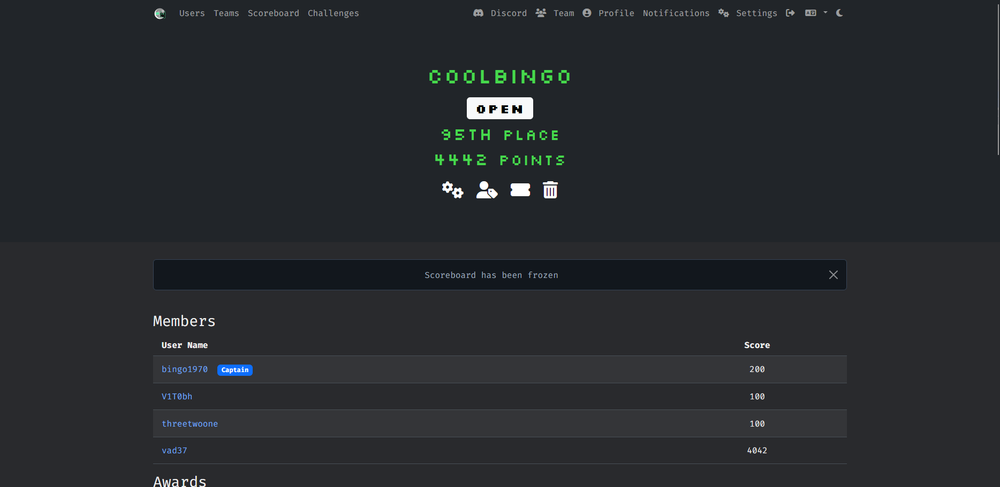

# GreyCTF 2026 — Competition Archive

This repo is the actual workspace I used during GreyCTF 2026.
I have no background in forensics, so I approach this contest purely with the intention to test AI agent workflow capabilities and how well it can solve without me assisting it.

The only limitation I have is the **Claude Max x5** plan, which gives **10M tokens per week**, with a soft limit of about **1–2M tokens inside each 5-hour window**.

I provide infrastructure and tooling assistance before the contest starts, so the agent knows which tools are available and allowed to run, and how to approach the CTF competition to download files and submit flags on its own.

## Disclaimer

This is for study only.

I want to encourage you to treat CTFs as a thing you _learn_, not a thing you
hand to an AI agent to finish for you. Right now the best model is good at detecting and solving
surface problems. The moment it touches a harder problem, it does not have a real plan; it leans heavily on the human's instructions, skills, and understanding to guide it.

And the only way to get that deeper understanding is the slow way: learn it
yourself, and make your own mistakes. There is no shortcut the agent can take for
you on that part.

So, simply: use the AI as a helper, keep yourself in the loop, and keep learning. That is the whole point.

## Setup

If you want to run this yourself, set it up in this order:

1. **Edit the [`.env`](.env.example) file first.** Fill in your CTFd URL and
   login. Do this before anything else, so Claude can do a test browser run and
   log in to the contest page on its own.
2. **Install the skills from the marketplace.** Check
   [`.claude/settings.json`](.claude/settings.json) — you need **Trail of Bits**
   and **caveman**.
3. **Install all the tools listed under [`docs/vendor/shop.md`](docs/vendor/shop.md).**
4. **Read [`.claude/skills/ctf-pipeline/SKILL.md`](.claude/skills/ctf-pipeline/SKILL.md).**
   This is the only instruction I provided for Claude.
5. **Run the contest with this prompt** (similar to the one I used - there is no need for complex prompt):

   > caveman contest is 30 minutes away. make a monitor 1 second interval with 1
   > minute before competition start. Then run workflow pipeline solve all. After
   > recon subagent, limit solving subagent to 5 agent max.

## The result

Inside a single 5-hour window and around **1M–2M tokens**, about **~10
challenges** could be one-shot solved by a subagent with no hand-holding.

<!-- result screenshot here -->

A few rough numbers I noticed:

- **Easy challenge:** ~50K–100K tokens to auto-solve.
- **Harder challenge:** often **>300K tokens** — and past that point the model
  quality drops so much that it is usually better to start a fresh session than
  to keep pushing the same one.

## Solve timeline

Here is the timeline of solutions, in the order they fell. Times are from the CTFd scoreboard.
Around ~10 early challenges were all solved by the agent oneshot session, with 4 challenges solved by other teammates by hand.

Only one challenge needed human debugging skill (An old soviet terminal).
There were other challenges solved halfway as well, but they ran out of tokens — which is expected, since there is a lack of token-efficient usage within the Skill instructions.

| #   | Time        | Challenge               | Category | Points |
| --- | ----------- | ----------------------- | -------- | ------ |
| 1   | 05-30 09:18 | AE-no-S                 | Ezpz     | 100    |
| 2   | 05-30 09:27 | babyRSA                 | Ezpz     | 100    |
| 3   | 05-30 09:28 | Codex Computer Use      | Ezpz     | 100    |
| 4   | 05-30 09:32 | Say My Name             | Ezpz     | 444    |
| 5   | 05-30 09:33 | spidr                   | Rev      | 100    |
| 6   | 05-30 09:41 | Duality in All Things   | Ai       | 100    |
| 7   | 05-30 10:05 | Fort Knockies           | Ezpz     | 100    |
| 8   | 05-30 11:42 | filter_flag             | Crypto   | 100    |
| 9   | 05-30 11:43 | my-greycat              | Ezpz     | 100    |
| 10  | 05-30 13:41 | elite ball knowledge    | Pwn      | 551    |
| 11  | 05-30 15:48 | Jurgen's Revenge        | Ai       | 100    |
| 12  | 05-30 16:34 | Training Shooting Flags | Misc     | 804    |
| 13  | 05-30 17:03 | Gopher's Adventure!     | Rev      | 324    |
| 14  | 05-30 18:11 | babyheap                | Ezpz     | 100    |
| 15  | 05-30 18:42 | Wait a minute           | Misc     | 100    |
| 16  | 05-30 20:03 | GreyCat Game            | Web      | 100    |
| 17  | 05-30 23:56 | An old soviet terminal  | Misc     | 744    |
| 18  | 05-31 02:24 | caexor                  | Crypto   | 375    |

## Where the agent still struggles

With only generic instructions, the agent is still bad at a few things. These are
the patterns I saw again and again:

- **Shortcut loops.** To save tokens it tries a shortcut. The shortcut fails. So
  it tries the _same_ shortcut again, and again, burning tokens until it crashes.
  Example: it exported all 500 frames of a video and knew it had to read them to
  find a `flag{...}`. It read maybe 50–100 frames out of 500, then got stuck
  trying to make sense of nonsense text. The flag only showed up in 3 frames.

- **No token limit = blind digging.** On a single challenge it once burned ~2M
  tokens across 20 parallel subagents, only to confirm that the original attack
  path was a dead end — with no new idea to try next. Along the way it also
  forgot its own instruction to write and check its plan in local memory. When
  the context gets that bloated, early instructions just fall out.

- **Weak at tooling and infrastructure.** Against a server with rate limits or
  call throttling, it would not write its own script to handle it. Instead it
  leaned on the workflow timeout/monitor and forgot what the previous subagent
  had already done. This really needs a dedicated way to store memory between
  sessions — `/compact` does not do the job well.

- **Stuck reading heavy text/image challenges.** On something like _grey-yuumi_
  it got locked in a loop trying to figure out what one word looked like, and
  ignored that there might be other words, or a different problem entirely. Each
  new session just followed the last session's guess without ever asking if the
  whole path was wrong. A real per-session memory would help a lot here.

- **Over-relies on Python.** It leans hard on writing Python and wastes a lot of
  time fixing its own script bugs. It rarely stops to think that the code is
  going to run against a real production server, and plans for that up front.
  This is a design-awareness and good-habit gap, not a knowledge gap.

